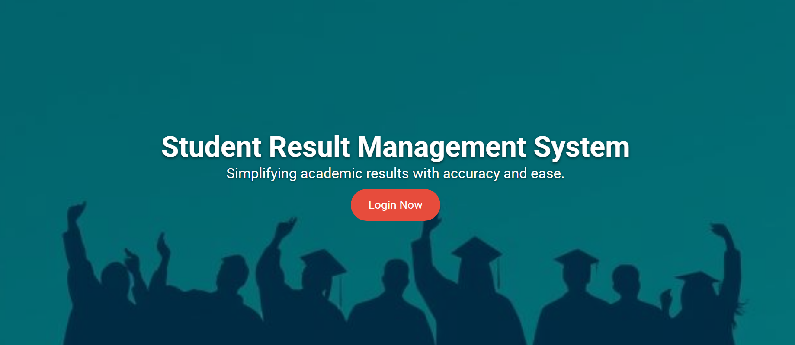
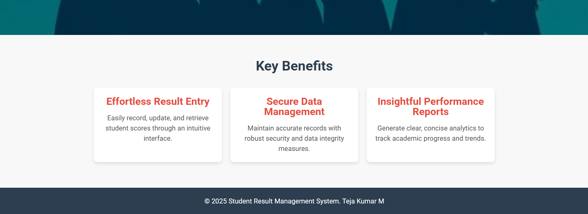
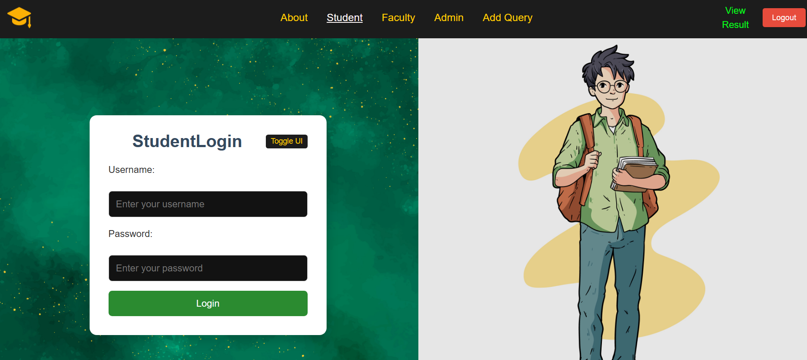
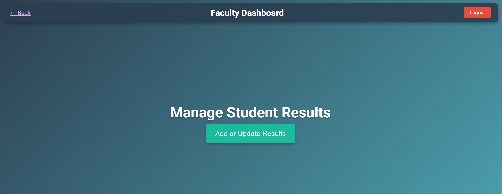
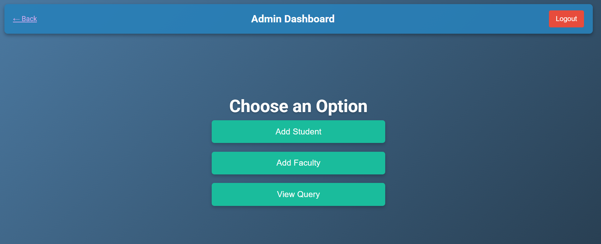

 ## 
 ## 

# Student Result Management System

Welcome to the **Student Result Management System** repository. This project is a full-stack web application designed to streamline and enhance the process of managing student results. It features a modern React front end and a robust Spring Boot back end connected to a relational database.

## Table of Contents
- [Overview](#overview)
- [Features](#features)
- [Tech Stack](#tech-stack)
- [Usage](#usage)
- [Setup and Installation](#setup-and-installation)
  - [Front End (React)](#front-end-react)
  - [Back End (Spring Boot)](#back-end-spring-boot)


## Overview

The Student Result Management System simplifies the process of entering, updating, and analyzing student results. It is designed for educational institutions to easily manage academic performance, with separate interfaces for students, faculty, and administrators.

## Features

- **User-Friendly Dashboard:**  
  Intuitive interfaces for students to view their results, for faculty to manage result data, and for administrators to oversee the entire system.
- **Effortless Data Entry:**  
  Streamlined forms for quick result entry and updates.
- **Real-Time Analytics:**  
  Generate performance reports and trend analyses in real time.
- **Secure Data Management:**  
  Role-based access control ensures data integrity and security.
- **Responsive Design:**  
  A modern, responsive UI that works seamlessly across desktop and mobile devices.

## Tech Stack

- **Front End:** React, CSS Modules  
- **Back End:** Spring Boot (Java), RESTful APIs  
- **Database:** MySQL


## Usage
- **Student Portal:** Log in to view results and manage your profile.
- **Faculty Portal:** Faculty members can add or update student results and view performance analytics.
- **Admin Portal:** Administrators can manage user accounts and review system queries.

## Screenshots
- Below are some screenshots to showcase the project:

- Student Login Page
 ## 

- Faculty Dashboard
 ## 

- Admin Dashboard
 ## 

 ## Project Assets

For additional screenshots and media, please visit the [IMAGES_SRMS Folder](./IMAGES_SRMS).


## Setup and Installation

### Front End (React)

Use the following YAML snippet for the front-end setup:

```yaml
# Navigate to the front-end folder and install dependencies:
cd react
npm install

# To start the development server:
npm start

# To create a production build:
npm run build


# Navigate to the back-end folder:
cd srms

# Build the application (using Maven):
mvn clean package

# Run the application:
java -jar target/your-app-name.jar


